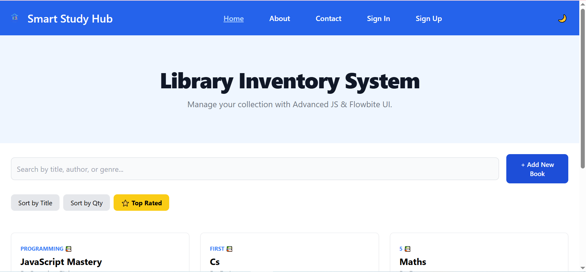
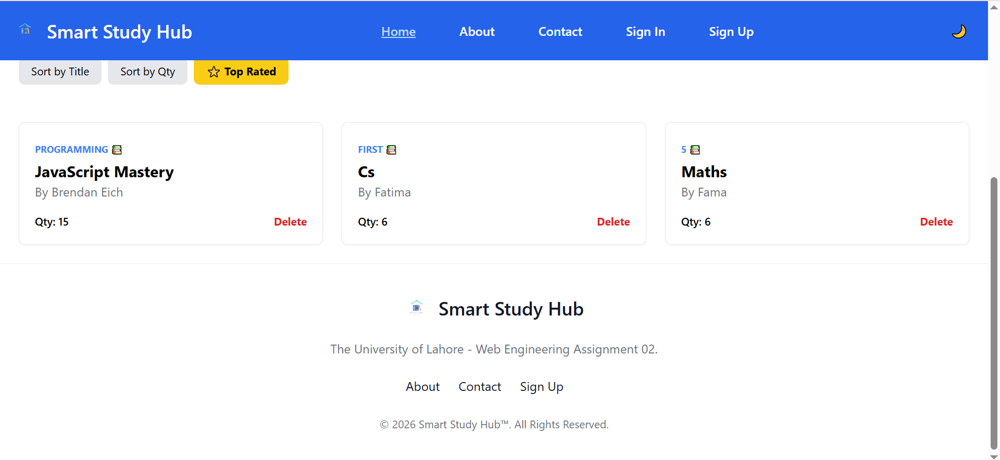
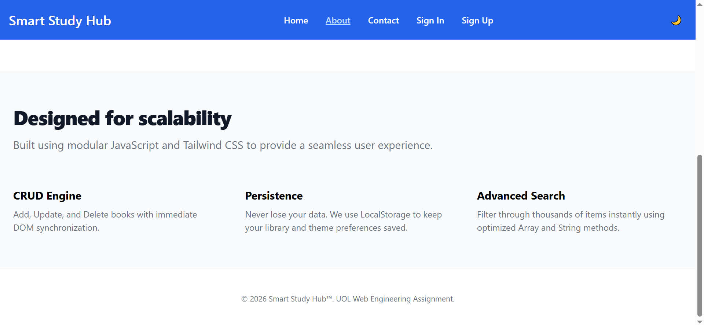
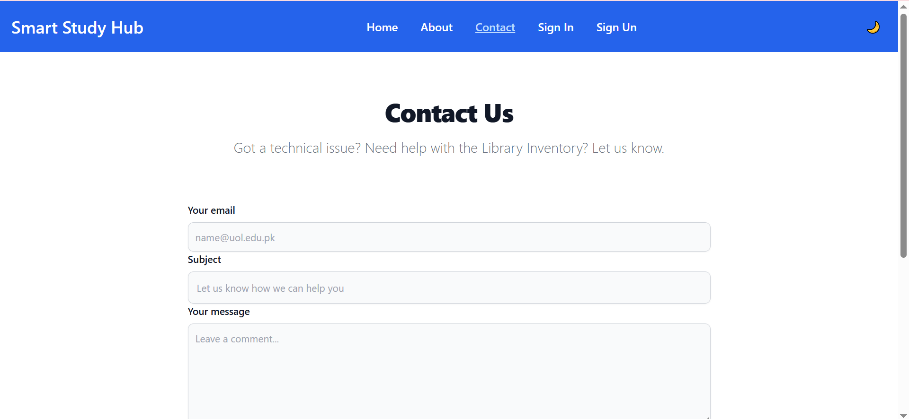
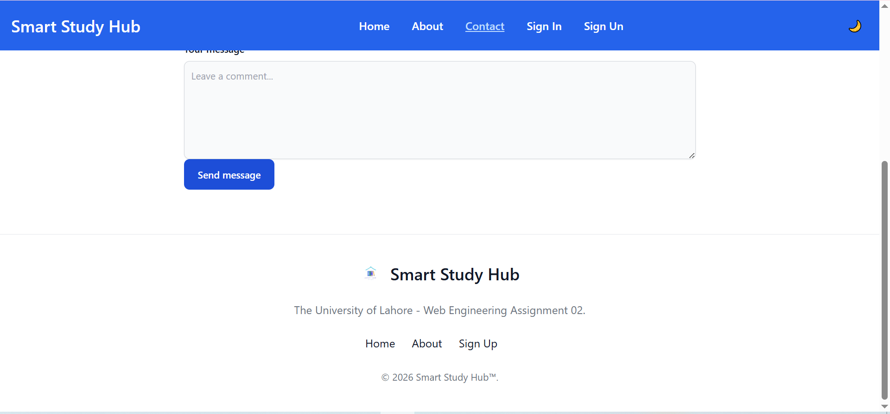
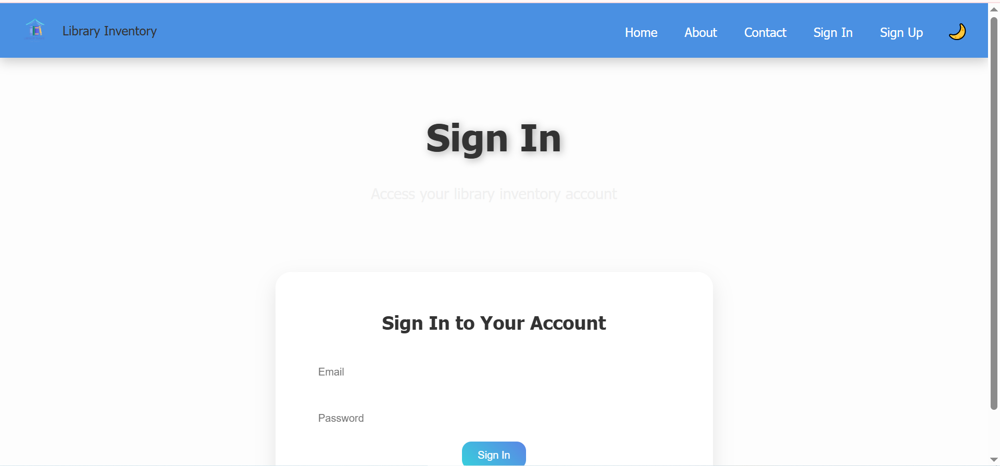
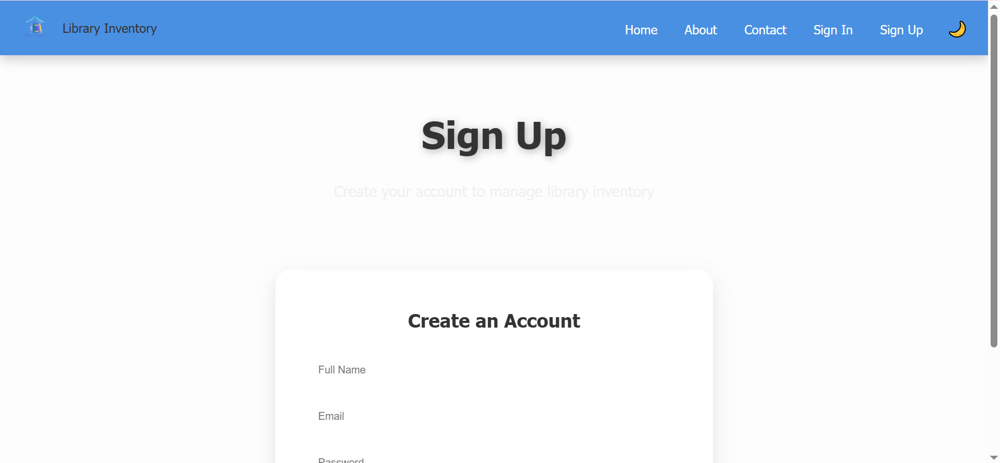
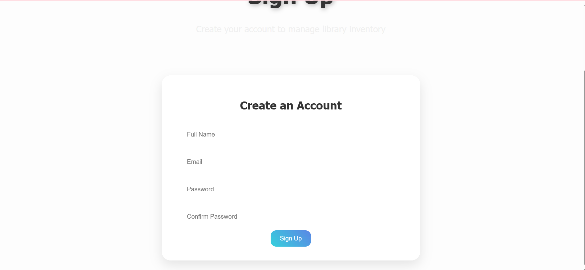

📚 Smart Study Hub - Library Inventory System
University of Lahore | Web Engineering (CS-312) | Assignment 02
 📌 Project Overview

This project is developed for the Web Engineering – Assignment 02 (Spring 2026) at The University of Lahore. It transforms a static library interface into a dynamic **Library Inventory System** using modern JavaScript (ES6+), DOM manipulation, and persistent storage.

The system allows librarians and students to manage book records through a clean, responsive UI built with Tailwind CSS and Flowbite.

 Key Features

  * Multiple Web Pages: Fully linked Home, About, Contact, Sign In, and Sign Up pages.
  * CRUD Operations:
      * Add: Create new book records via a modal form.
      * Read: Display book cards dynamically from local data and storage.
      * Delete: Remove books with immediate DOM synchronization.
  * Search & Filter System**:
      * Real-time search by Title or Author.
      * Filter by "Top Rated" (Quantity \> 10).
      * Sorting by Title or Quantity.
  * Dark / Light Mode:
      * Interactive toggle in the navigation bar.
      * Persistent theme using `localStorage`.
  * Functional Contact Form: Integrated with Formspree API for real-time email submissions.
  * Advanced String Processing: Implements 10+ JavaScript string methods for data sanitization (trim, split, replace, etc.).

🛠 Technologies Used

  * **HTML5 & CSS3** (Tailwind CSS Framework)
  * **JavaScript (ES6+)**: Modules, Classes, and Array Methods
  * **DOM Manipulation**: Dynamic rendering and event handling
  * **Formspree API**: Backend-less form handling
  * **GitHub Pages**: Deployment and hosting

-----

📁 Project Structure

/
├── index.html                # Main Inventory Dashboard
├── theme.js                  # Global Theme Persistence Logic
├── assets/
│   └── logos/
│       └── logo.png          # Standardized Project Logo
├── src/
│   ├── constants/
│   │   └── themeconstants.js # Theme keys and configuration
│   ├── database/
│   │   └── data.js           # Initial library data array
│   ├── home/
│   │   └── home.js           # Core CRUD & Search logic
│   └── pages/
│       ├── about.html        # Project information page
│       └── contact.html      # Functional contact form
└── account/
    ├── signin.html           # User Sign-In interface
    └── signup.html           # User Registration interface
🌐 Live Demo
(https://70148555-hue.github.io/Library-System/)
🔗 GitHub Repository
(https://github.com/70148555-hue/Library-System)
📸 Screenshots

Home Page (Inventory Dashboard)

About Pages

 Contact Pages

Authentication :
Sign In

Sign Up

Project Folder Structure (VS Code)
👨‍💻 Author

  * Student: fatima Naeem
  * Program: BS Computer Science
  * University: The University of Lahore